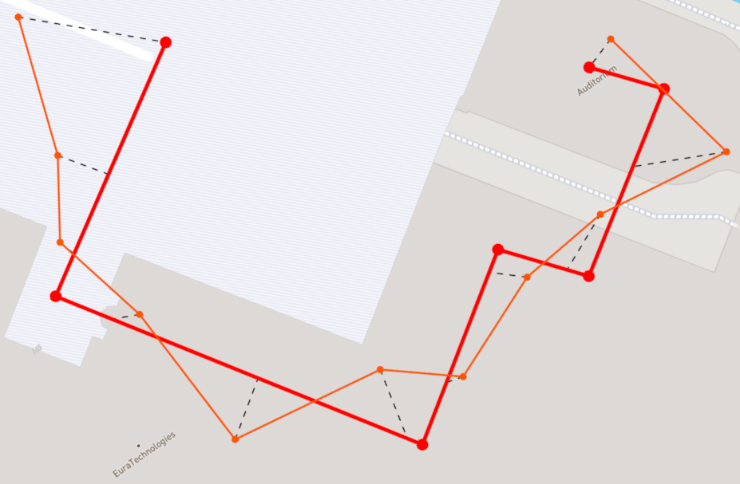

# @indoor-analytics/path-distance

Computes distance between two paths by projecting positions of the second (acquired) path 
onto the first (reference) one.
This allows to compare paths with different location counts.

|  |
|:--:|
| *comparing two paths* |

## Distance algorithm formalization

For each acquired path location, we create a projection on the reference path; first path location
will always match first reference path, the same for the last location.

A projected position is obtained by:
1. getting distance between the current path position and the path origin;
2. computing the ratio position distance / path length;
3. computing the equivalent distance regarding the reference path;
4. projecting the position on the reference path.
