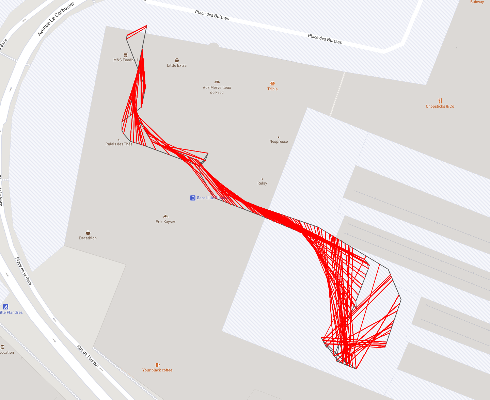
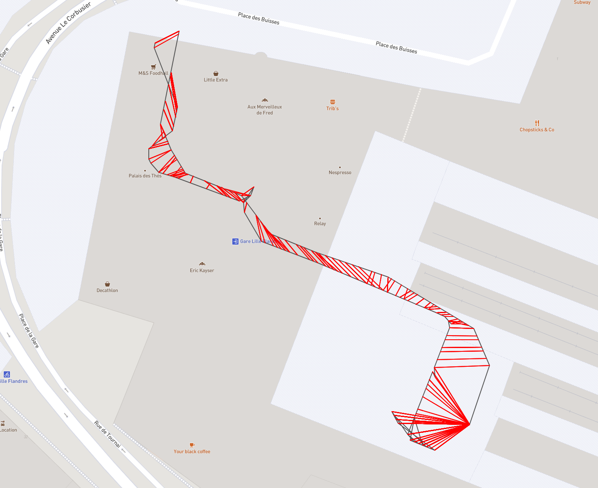

# @indoor-analytics/path-distance

Computes distance between two paths by projecting positions of the second (acquired) path 
onto the first (reference) one.
This allows to compare paths with different location counts.

|  |  |
|:--:|:--:|
| *comparing two paths* | *comparing same paths with time information taken into account* |

## How to use

Add this line to `~/.npmrc` to set up the package registry: 
```shell
@indoor-analytics:registry=https://npm.pkg.github.com/indoor-analytics
```

In your project, install the package:
```shell
npm i --save @indoor-analytics/path-distance
```

Import the function in your code:
```javascript
import {pathDistance} from '@indoor-analytics/path-distance';
```

## Algorithms 

### Classic distance

For each acquired path location, we create a projection on the reference path; first path location
will always match first reference path, the same for the last location.

A projected position is obtained by:
1. getting distance between the current path position and the path origin;
2. computing the ratio position distance / path length;
3. computing the equivalent distance regarding the reference path;
4. projecting the position on the reference path.

### Timed distance

For each path reference path segment (made by two consecutive path points):
1. get both points' timestamps;
2. get compared path segment whose locations have been captured while walking current reference path segment;
3. compare reference path segment and compared path segment using classic distance algorithm 
